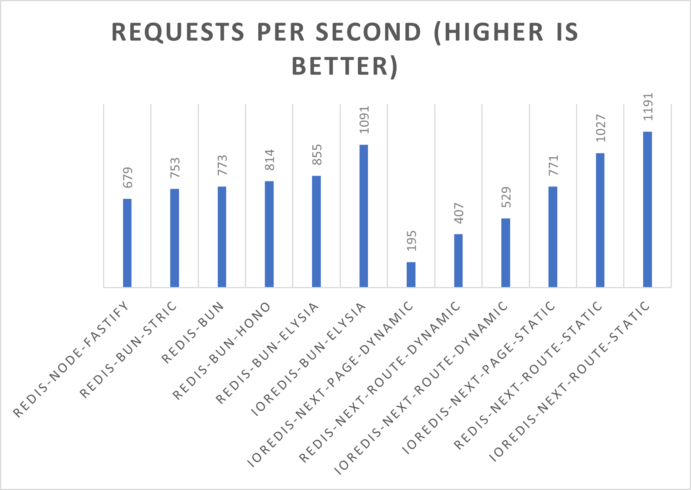
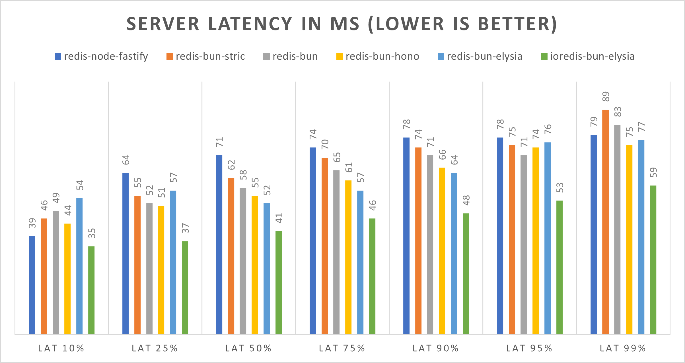
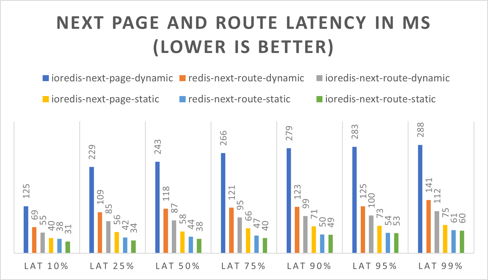

# Redis node and bun performance benchmarks

This is just a simple repo that contains `redis` and `ioredis` implemented in various node and bun servers.

The servers are configured to run a single route where they run the following command:

`xread OPTIONS:test:STREAM - +`

This reads all entries from the `OPTIONS:test:STREAM` redis stream which is a 20kb stream containing 339 entries. 

## Setup

All the packages connect to redis in localhost and port 6379 so you need to have it running in the same configuration.

The `dump.rdb` has the stream object from which the servers read the data, so you need to restore that file unto your redis
instance.

### Packages
| package 	| version 	|
|---------	|---------	|
| node    	| 20.1    	|
| bun     	| 0.6.2   	|
| redis   	| 4.6.6   	|
| ioredis 	| 5.3.2   	|
| [Elysia](https://elysiajs.com/) 	| 0.5.2   	|
| [Hono](https://github.com/honojs/hono)   	| 3.2.1   	|
| [Stric](https://github.com/bunsvr)   	| 1.0.6   	|
| [Fastify](https://www.fastify.io/) 	| 4.17.0  	|
| [Next](https://nextjs.org/)    	| 13.4.3  	|

## Results:

All these results were run in an Ubuntu 22 WSL 2 instance in some dude's laptop with a:

`Ryzen 5 5600x @4.5Ghz / 16Gb DDR4 @3600MT/s`

| server                     	| req/s 	| latency 10% in ms 	 | lat 25% 	| lat 50% 	| lat 75% 	| lat 90% 	| lat 95% 	| lat 99% 	|
|----------------------------	|-------	|---------------------|---------	|---------	|---------	|---------	|---------	|---------	|
| redis-node-fastify         	| 679   	| 39          	       | 64      	| 71      	| 74      	| 78      	| 78      	| 79      	|
| redis-stric                	| 753   	| 46          	       | 55      	| 62      	| 70      	| 74      	| 75      	| 89      	|
| redis-bun                  	| 773   	| 49          	       | 52      	| 58      	| 65      	| 71      	| 71      	| 83      	|
| redis-bun-hono             	| 814   	| 44          	       | 51      	| 55      	| 61      	| 66      	| 74      	| 75      	|
| redis-bun-elysia           	| 855   	| 54          	       | 57      	| 52      	| 57      	| 64      	| 76      	| 77      	|
| ioredis-bun-elysia         	| 1091  	| 35          	       | 37      	| 41      	| 46      	| 48      	| 53      	| 59      	|
| ioredis-next-page-dynamic  	| 195   	| 125         	       | 229     	| 243     	| 266     	| 279     	| 283     	| 288     	|
| redis-next-route-dynamic   	| 407   	| 69          	       | 109     	| 118     	| 121     	| 123     	| 125     	| 141     	|
| ioredis-next-route-dynamic 	| 529   	| 55          	       | 85      	| 87      	| 95      	| 99      	| 100     	| 112     	|
| ioredis-next-page-static   	| 771   	| 40          	       | 56      	| 58      	| 66      	| 71      	| 73      	| 75      	|
| redis-next-route-static    	| 1027  	| 38          	       | 42      	| 44      	| 47      	| 50      	| 54      	| 61      	|
| ioredis-next-route-static  	| 1191  	| 31          	       | 34      	| 38      	| 40      	| 49      	| 53      	| 60      	|

